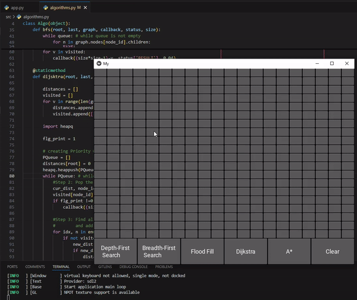
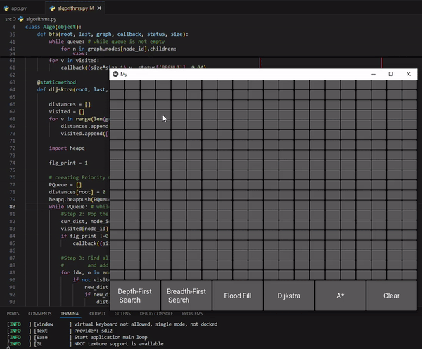
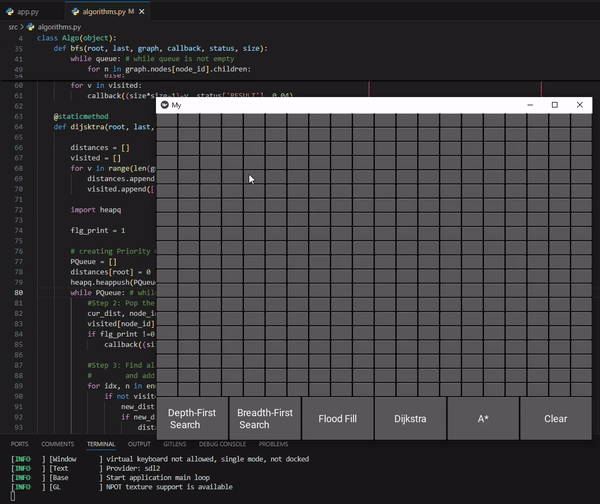
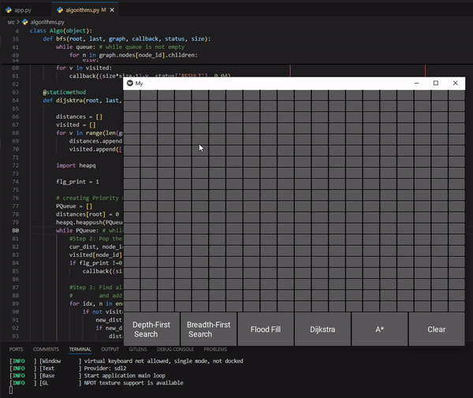
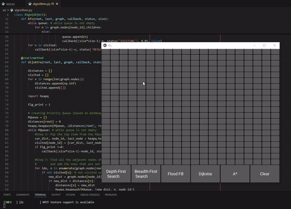

# Graph Kivy Pathfinding Visualizer

This project is a pathfinding visualizer implemented using Kivy and Pygame. It includes several pathfinding algorithms such as Depth-First Search (DFS), Breadth-First Search (BFS), Dijkstra's Algorithm, Flood Fill, and A\* Search. The visualizer allows you to see how these algorithms work in real-time.

## Algorithms

### Depth-First Search (DFS)

DFS is an algorithm for traversing or searching tree or graph data structures. It starts at the root node and explores as far as possible along each branch before backtracking.

**Implementation Summary:**
The DFS algorithm is implemented in the `dfs` method of the `MyGrid` class in [src/app.py](src/app.py). It uses a stack to keep track of the nodes to be visited next.

  <p align="center" >
    
  </p>

### Breadth-First Search (BFS)

BFS is an algorithm for traversing or searching tree or graph data structures. It starts at the root node and explores all of the neighbor nodes at the present depth prior to moving on to the nodes at the next depth level.

**Implementation Summary:**
The BFS algorithm is implemented in the `bfs` method of the `MyGrid` class in [src/app.py](src/app.py). It uses a queue to keep track of the nodes to be visited next.

  <p align="center" >
    
  </p>

### Dijkstra's Algorithm

Dijkstra's Algorithm is an algorithm for finding the shortest paths between nodes in a graph, which may represent, for example, road networks.

**Implementation Summary:**
The Dijkstra's algorithm is implemented in the `dijsk` method of the `MyGrid` class in [src/app.py](src/app.py). It uses a priority queue to keep track of the nodes to be visited next, based on the shortest known distance from the start node.

  <p align="center" >
    
  </p>

### Flood Fill

Flood Fill is an algorithm that determines the area connected to a given node in a multi-dimensional array.

**Implementation Summary:**
The Flood Fill algorithm is implemented in the `flood_fill` method of the `MyGrid` class in [src/app.py](src/app.py). It uses a queue to keep track of the nodes to be visited next.

  <p align="center" >
    
  </p>

### A\* Search

A\* Search is an algorithm that is used in pathfinding and graph traversal. It is an extension of Dijkstra's Algorithm with an additional heuristic to guide the search.

**Implementation Summary:**
The A\* algorithm is implemented in the `a_star` method of the `MyGrid` class in [src/app.py](src/app.py). It uses a priority queue to keep track of the nodes to be visited next, based on the sum of the known distance from the start node and a heuristic estimate of the distance to the goal node.

  <p align="center" >
    
  </p>

## How to Run

1. Create a virtual environment:

   ```sh
   python -m venv venv
   ```

2. Activate the virtual environment:

   - On Windows:
     ```sh
     .\venv\Scripts\activate
     ```
   - On macOS and Linux:
     ```sh
     source venv/bin/activate
     ```

3. Install the required dependencies:

   ```sh
   pip install -r requirements.txt
   ```

4. Run the application:
   ```sh
   python src/app.py
   ```

## File Structure

- `src/`: Contains the source code for the application.
  - `app.py`: Main application file.
  - `algorithms.py`: Contains the implementation of the pathfinding algorithms.
  - `graph.py`: Contains the graph data structure used by the algorithms.
  - `utils.py`: Utility functions used by the application.
- `docs/`: Contains documentation and media files.
  - `figs/`: Contains GIF images demonstrating each algorithm.
- `resources/`: Contains additional resources such as configuration files and assets.

## License

This project is licensed under the MIT License.
